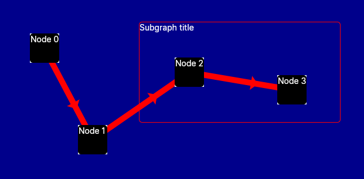

## AvaloniaGraphs

AvaloniaGraphs is a simple graph plotting library for Avalonia UI.



### How to use

1. Define a graph like this:

```csharp

# define nodes, 
# ContentControl is a control that will be displayed as a body of the node
var node0 = new GraphNode() { ContentControl = new TextBlock() { Text = "Node 0" } };
var node1 = new GraphNode() { ContentControl = new TextBlock() { Text = "Node 1" } };
var node2 = new GraphNode() { ContentControl = new TextBlock() { Text = "Node 2" } };

graph = new Graph()
{
    # We need to add nodes to the graph
    Nodes = {
        node0,
        node1,
        node2
    },

    # We need to define edges between nodes
    Edges = {
        new GraphEdge(node0, node1) { IsDirected = true },
        new GraphEdge(node1, node2) { IsDirected = true },
        new GraphEdge(node2, node0) { IsDirected = true },
    },

    # We need to define a type of layout for the graph
    # it specifies how the nodes will be positioned
    Layout = new SpringGraphLayout()
    {
        Iterations = 100,
        Width = 800,
        Height = 400,
        WithAnimation = true
    },
};

```

2. Add the graph to the window:

```csharp
# We need to create special control for the graph and add it to the window
var graphView = new GraphView(graph);

# We can also apply layout to the graph
graph.Layout?.ApplyLayout(graph);


mainPanel.Children.Add(graphView);
```

### Examples

Can be found in AvaloniaGraphs/Views/MainWindow.xaml.cs

You can uncomment here the example you want to run.